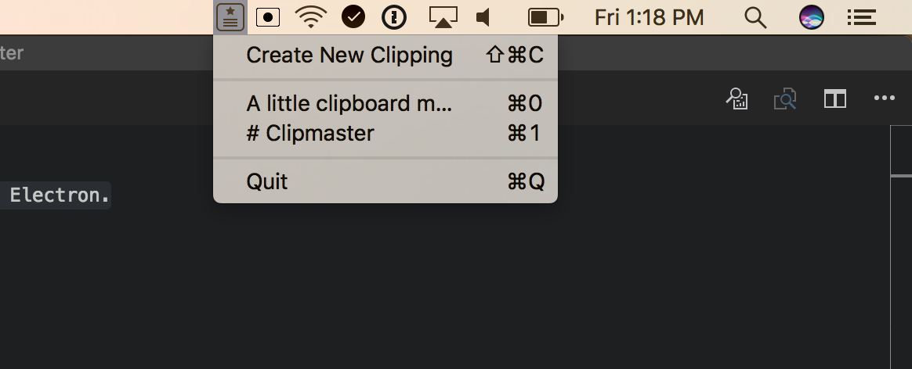

# Clippy

> Electron tray only application, with system global keyboard shortcuts and examples on how to work with OS clipboard

A little clipboard manager built in Electron. Clippy saves text from your clipboard for later use.

# Global Shortcuts

-   <kbd>⌘⌥C</kbd>: activate Clipmaster
-   <kbd>⌘⌥⇧C</kbd>: save a new clipping to Clipmaster

@source [Electron in Action](https://www.goodreads.com/book/show/35620138-electron-in-action)
